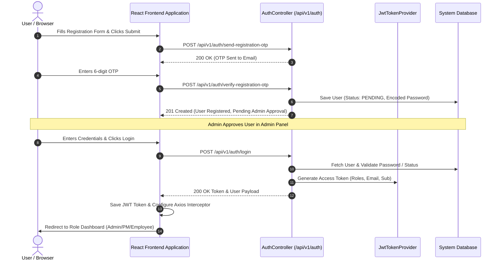

# Flow Deck – Frontend API Integration Guide & Specification

> **Target Audience:** Frontend Developers (React.js / Next.js)  
> **Backend Base URL:** `http://localhost:8080` (or `http://localhost:8080/api/v1`)  
> **API Standard:** RESTful JSON  
> **Authentication Header:** `Authorization: Bearer <JWT_TOKEN>`

---

## Table of Contents
1. [01 Authentication](#01-authentication)
2. [02 Dashboard](#02-dashboard)
3. [03 Department Management](#03-department-management)
4. [04 Designation Management](#04-designation-management)
5. [05 User Management](#05-user-management)
6. [06 Role Management](#06-role-management)
7. [07 Project Management](#07-project-management)
8. [08 Project Manager Workspace](#08-project-manager-workspace)
9. [09 Employee Workspace](#09-employee-workspace)
10. [10 Notifications](#10-notifications)
11. [Complete Frontend Screen List](#1-complete-frontend-screen-list)
12. [API Flow Diagram](#2-api-flow-diagram)
13. [Authentication Flow](#3-authentication-flow)
14. [APIs Called on Each Screen](#4-which-apis-are-called-on-each-screen)
15. [Recommended React Folder Structure](#5-recommended-react-folder-structure)
16. [API Integration Order for Frontend Development](#6-api-integration-order-for-frontend-development)

---

## Standard Error Response Structure
All API errors return standard payload formatted by `GlobalExceptionHandler`:
```json
{
  "success": false,
  "message": "Error description or Validation failed",
  "data": {
    "fieldName": "Validation error message"
  },
  "timestamp": "2026-08-11T12:00:00"
}
```

---

## 01 Authentication

### 1. Register User
- **Module Name:** 01 Authentication
- **Endpoint URL:** `/api/v1/auth/register`
- **HTTP Method:** `POST`
- **Authentication Required:** No
- **Required Role:** Public
- **Request Headers:** `Content-Type: application/json`
- **Path Variables:** None
- **Query Parameters:** None
- **Request Body (sample JSON):**
  ```json
  {
    "firstName": "Lakshya",
    "lastName": "Soni",
    "email": "lakshya.soni@example.com",
    "password": "Password@123",
    "mobile": "9876543210",
    "gender": "Male",
    "dob": "1998-05-15",
    "address": "123 Tech Park, MG Road",
    "cityId": 1,
    "departmentId": 1,
    "designationId": 1
  }
  ```
- **Success Response (201 Created):**
  ```json
  {
    "success": true,
    "message": "User registered successfully",
    "data": {
      "id": 10,
      "email": "lakshya.soni@example.com",
      "message": "User registered successfully"
    },
    "timestamp": "2026-08-11T12:00:00"
  }
  ```
- **Possible Error Responses:**
  - `400 Bad Request`: `{"success": false, "message": "Email already exists"}`
- **Validation Rules:**
  - `firstName`: Required, max 45 chars
  - `lastName`: Required, max 45 chars
  - `email`: Required, valid email format, max 45 chars
  - `password`: Required, 6-45 chars
  - `mobile`: Optional, exact 10 digits (`^[0-9]{10}$`)
- **Purpose:** Registers a user account directly without requiring OTP verification. Account created in `PENDING` approval status.
- **Frontend Page:** `/register` (Registration Form Page)
- **When Called:** On submission of direct registration form.
- **Requires JWT Token:** No
- **Dependencies:** Valid `cityId`, `departmentId`, `designationId` fetched from master data dropdowns.

---

### 2. Send Registration OTP
- **Module Name:** 01 Authentication
- **Endpoint URL:** `/api/v1/auth/send-registration-otp`
- **HTTP Method:** `POST`
- **Authentication Required:** No
- **Required Role:** Public
- **Request Headers:** `Content-Type: application/json`
- **Path Variables:** None
- **Query Parameters:** None
- **Request Body (sample JSON):**
  ```json
  {
    "firstName": "Lakshya",
    "lastName": "Soni",
    "email": "lakshya.soni@example.com",
    "password": "Password@123",
    "mobile": "9876543210",
    "gender": "Male",
    "dob": "1998-05-15",
    "address": "123 Tech Park, MG Road",
    "cityId": 1,
    "departmentId": 1,
    "designationId": 1
  }
  ```
- **Success Response (200 OK):**
  ```json
  {
    "success": true,
    "message": "Registration OTP sent successfully to lakshya.soni@example.com",
    "data": null,
    "timestamp": "2026-08-11T12:00:00"
  }
  ```
- **Possible Error Responses:**
  - `400 Bad Request`: `{"success": false, "message": "User with this email already exists"}`
- **Validation Rules:**
  - `firstName`, `lastName`, `email`, `password` are mandatory. Email must be unique.
- **Purpose:** Validates payload details, generates a 6-digit registration OTP, temporarily stores payload, and dispatches email OTP.
- **Frontend Page:** `/register-otp` (Step 1 of Multi-step OTP Registration)
- **When Called:** When user fills registration details and clicks "Send OTP".
- **Requires JWT Token:** No
- **Dependencies:** Valid email and master data IDs.

---

### 3. Verify Registration OTP
- **Module Name:** 01 Authentication
- **Endpoint URL:** `/api/v1/auth/verify-registration-otp`
- **HTTP Method:** `POST`
- **Authentication Required:** No
- **Required Role:** Public
- **Request Headers:** `Content-Type: application/json`
- **Path Variables:** None
- **Query Parameters:** None
- **Request Body (sample JSON):**
  ```json
  {
    "email": "lakshya.soni@example.com",
    "otp": "123456"
  }
  ```
- **Success Response (201 Created):**
  ```json
  {
    "success": true,
    "message": "User registered successfully",
    "data": {
      "id": 12,
      "email": "lakshya.soni@example.com",
      "message": "User registered successfully"
    },
    "timestamp": "2026-08-11T12:00:00"
  }
  ```
- **Possible Error Responses:**
  - `400 Bad Request`: `{"success": false, "message": "Invalid or expired OTP"}`
- **Validation Rules:**
  - `email`: Required, valid format
  - `otp`: Required, exact 6 digits
- **Purpose:** Verifies registration OTP code. On success, persists user account with BCrypt encoded password in `PENDING` approval status and sends welcome email.
- **Frontend Page:** `/verify-registration-otp` (Step 2 of OTP Registration)
- **When Called:** When user enters the 6-digit OTP code received on email.
- **Requires JWT Token:** No
- **Dependencies:** Must have called `Send Registration OTP` first.

---

### 4. Login
- **Module Name:** 01 Authentication
- **Endpoint URL:** `/api/v1/auth/login`
- **HTTP Method:** `POST`
- **Authentication Required:** No
- **Required Role:** Public
- **Request Headers:** `Content-Type: application/json`
- **Path Variables:** None
- **Query Parameters:** None
- **Request Body (sample JSON):**
  ```json
  {
    "email": "lakshya.soni@example.com",
    "password": "Password@123"
  }
  ```
- **Success Response (200 OK):**
  ```json
  {
    "success": true,
    "message": "Login successful",
    "data": {
      "token": "eyJhbGciOiJIUzI1NiJ9...",
      "tokenType": "Bearer",
      "user": {
        "id": 12,
        "firstName": "Lakshya",
        "lastName": "Soni",
        "email": "lakshya.soni@example.com",
        "mobile": "9876543210",
        "gender": "Male",
        "dob": "1998-05-15",
        "address": "123 Tech Park, MG Road",
        "isActive": true,
        "cityName": "Indore",
        "departmentName": "Engineering",
        "designationName": "Software Engineer",
        "roles": ["ROLE_EMPLOYEE"],
        "approvalStatus": "APPROVED",
        "createdAt": "2026-08-11T10:00:00"
      }
    },
    "timestamp": "2026-08-11T12:00:00"
  }
  ```
- **Possible Error Responses:**
  - `401 Unauthorized`: `{"success": false, "message": "Invalid email or password"}`
  - `401 Unauthorized`: `{"success": false, "message": "User registration is pending Admin approval"}`
- **Validation Rules:**
  - `email`: Required, valid email
  - `password`: Required
- **Purpose:** Authenticates user credentials, ensures account is approved and active, and returns JWT Bearer token along with profile and assigned roles.
- **Frontend Page:** `/login` (Login Page)
- **When Called:** Upon user login form submission.
- **Requires JWT Token:** No
- **Dependencies:** User must be registered, approved by Admin, and active.

---

### 5. Forgot Password
- **Module Name:** 01 Authentication
- **Endpoint URL:** `/api/v1/auth/forgot-password`
- **HTTP Method:** `POST`
- **Authentication Required:** No
- **Required Role:** Public
- **Request Headers:** `Content-Type: application/json`
- **Path Variables:** None
- **Query Parameters:** None
- **Request Body (sample JSON):**
  ```json
  {
    "email": "lakshya.soni@example.com",
    "purpose": "FORGOT_PASSWORD"
  }
  ```
- **Success Response (200 OK):**
  ```json
  {
    "success": true,
    "message": "Password reset OTP sent successfully",
    "data": {
      "email": "lakshya.soni@example.com",
      "purpose": "FORGOT_PASSWORD",
      "isVerified": false,
      "message": "OTP sent to email"
    },
    "timestamp": "2026-08-11T12:00:00"
  }
  ```
- **Possible Error Responses:**
  - `404 Not Found`: `{"success": false, "message": "User not found with email: lakshya.soni@example.com"}`
- **Validation Rules:**
  - `email`: Required
  - `purpose`: Required
- **Purpose:** Generates a password reset OTP and emails it to registered user.
- **Frontend Page:** `/forgot-password`
- **When Called:** When user clicks "Forgot Password" and submits email.
- **Requires JWT Token:** No
- **Dependencies:** Registered user email.

---

### 6. Send OTP
- **Module Name:** 01 Authentication
- **Endpoint URL:** `/api/v1/auth/send-otp`
- **HTTP Method:** `POST`
- **Authentication Required:** No
- **Required Role:** Public
- **Request Headers:** `Content-Type: application/json`
- **Path Variables:** None
- **Query Parameters:** None
- **Request Body (sample JSON):**
  ```json
  {
    "email": "lakshya.soni@example.com",
    "purpose": "VERIFICATION"
  }
  ```
- **Success Response (200 OK):**
  ```json
  {
    "success": true,
    "message": "OTP sent successfully",
    "data": {
      "email": "lakshya.soni@example.com",
      "purpose": "VERIFICATION",
      "isVerified": false,
      "message": "OTP dispatched"
    },
    "timestamp": "2026-08-11T12:00:00"
  }
  ```
- **Possible Error Responses:**
  - `400 Bad Request`: `{"success": false, "message": "Invalid email or purpose"}`
- **Validation Rules:** `email` and `purpose` required.
- **Purpose:** Generic endpoint to generate and dispatch OTP for specified purpose.
- **Frontend Page:** `/verify-otp`
- **When Called:** On user action requesting generic OTP dispatch.
- **Requires JWT Token:** No
- **Dependencies:** None.

---

### 7. Verify OTP
- **Module Name:** 01 Authentication
- **Endpoint URL:** `/api/v1/auth/verify-otp`
- **HTTP Method:** `POST`
- **Authentication Required:** No
- **Required Role:** Public
- **Request Headers:** `Content-Type: application/json`
- **Path Variables:** None
- **Query Parameters:** None
- **Request Body (sample JSON):**
  ```json
  {
    "email": "lakshya.soni@example.com",
    "purpose": "FORGOT_PASSWORD",
    "otp": "654321"
  }
  ```
- **Success Response (200 OK):**
  ```json
  {
    "success": true,
    "message": "OTP verified successfully",
    "data": {
      "email": "lakshya.soni@example.com",
      "purpose": "FORGOT_PASSWORD",
      "isVerified": true,
      "message": "OTP verified"
    },
    "timestamp": "2026-08-11T12:00:00"
  }
  ```
- **Possible Error Responses:**
  - `400 Bad Request`: `{"success": false, "message": "Invalid or expired OTP"}`
- **Validation Rules:** `email`, `purpose`, `otp` required.
- **Purpose:** Validates generic OTP code.
- **Frontend Page:** `/forgot-password-verify`
- **When Called:** User enters received OTP code.
- **Requires JWT Token:** No
- **Dependencies:** Must have called `send-otp` or `forgot-password`.

---

### 8. Reset Password
- **Module Name:** 01 Authentication
- **Endpoint URL:** `/api/v1/auth/reset-password`
- **HTTP Method:** `POST`
- **Authentication Required:** No
- **Required Role:** Public
- **Request Headers:** `Content-Type: application/json`
- **Path Variables:** None
- **Query Parameters:** None
- **Request Body (sample JSON):**
  ```json
  {
    "email": "lakshya.soni@example.com",
    "otp": "654321",
    "newPassword": "NewPassword@123"
  }
  ```
- **Success Response (200 OK):**
  ```json
  {
    "success": true,
    "message": "Password reset successfully",
    "data": "Password updated",
    "timestamp": "2026-08-11T12:00:00"
  }
  ```
- **Possible Error Responses:**
  - `400 Bad Request`: `{"success": false, "message": "OTP is not verified or invalid"}`
- **Validation Rules:** `email`, `otp`, `newPassword` (6-45 chars) required.
- **Purpose:** Updates user password using verified OTP code.
- **Frontend Page:** `/reset-password`
- **When Called:** On submitting new password.
- **Requires JWT Token:** No
- **Dependencies:** Verified OTP.

---

### 9. Resend OTP
- **Module Name:** 01 Authentication
- **Endpoint URL:** `/api/v1/auth/resend-otp`
- **HTTP Method:** `POST`
- **Authentication Required:** No
- **Required Role:** Public
- **Request Headers:** `Content-Type: application/json`
- **Path Variables:** None
- **Query Parameters:** None
- **Request Body (sample JSON):**
  ```json
  {
    "email": "lakshya.soni@example.com",
    "purpose": "FORGOT_PASSWORD"
  }
  ```
- **Success Response (200 OK):**
  ```json
  {
    "success": true,
    "message": "OTP resent successfully",
    "data": {
      "email": "lakshya.soni@example.com",
      "purpose": "FORGOT_PASSWORD",
      "isVerified": false,
      "message": "New OTP sent to email"
    },
    "timestamp": "2026-08-11T12:00:00"
  }
  ```
- **Possible Error Responses:**
  - `400 Bad Request`: `{"success": false, "message": "Failed to resend OTP"}`
- **Validation Rules:** `email`, `purpose` required.
- **Purpose:** Re-issues a fresh 6-digit OTP code to specified email.
- **Frontend Page:** `/verify-otp`
- **When Called:** When user clicks "Resend OTP" link/button on OTP screens.
- **Requires JWT Token:** No
- **Dependencies:** Previous OTP request.

---

## 02 Dashboard

### 1. Employee Dashboard
- **Module Name:** 02 Dashboard / Employee Workspace
- **Endpoint URL:** `/api/v1/employee/dashboard`
- **HTTP Method:** `GET`
- **Authentication Required:** Yes
- **Required Role:** EMPLOYEE
- **Request Headers:** `Authorization: Bearer <JWT_TOKEN>`
- **Path Variables:** None
- **Query Parameters:** None
- **Request Body:** None
- **Success Response (200 OK):**
  ```json
  {
    "success": true,
    "message": "Employee dashboard metrics retrieved successfully",
    "data": {
      "totalAssignedTasks": 15,
      "completedTasks": 10,
      "pendingTasks": 3,
      "overdueTasks": 2,
      "completionPercentage": 66.67,
      "upcomingDeadlines": [
        {
          "id": 101,
          "title": "Build Login Screen",
          "description": "Implement authentication form",
          "startDate": "2026-08-01",
          "dueDate": "2026-08-15",
          "estimatedHours": 16.0,
          "actualHours": 10.0,
          "completionPercentage": 75,
          "projectId": 1,
          "projectName": "Flow Deck LMS",
          "taskStatus": "IN_PROGRESS",
          "taskPriority": "HIGH",
          "taskType": "FEATURE"
        }
      ]
    },
    "timestamp": "2026-08-11T12:00:00"
  }
  ```
- **Possible Error Responses:**
  - `401 Unauthorized`: Token missing/invalid
  - `403 Forbidden`: Access denied - Employee role required
- **Validation Rules:** JWT token must belong to authenticated employee.
- **Purpose:** Aggregates personal task metrics, completion rates, and upcoming deadlines for the employee home screen.
- **Frontend Page:** `/employee/dashboard`
- **When Called:** On page load of Employee Dashboard.
- **Requires JWT Token:** Yes
- **Dependencies:** Active employee session.

---

### 2. Project Manager Dashboard Overview
- **Module Name:** 02 Dashboard / Project Manager Workspace
- **Endpoint URL:** `/api/v1/pm/projects/{projectId}/overview`
- **HTTP Method:** `GET`
- **Authentication Required:** Yes
- **Required Role:** PROJECT_MANAGER
- **Request Headers:** `Authorization: Bearer <JWT_TOKEN>`
- **Path Variables:**
  - `projectId` (Long): Target project ID
- **Query Parameters:** None
- **Request Body:** None
- **Success Response (200 OK):**
  ```json
  {
    "success": true,
    "message": "Project overview retrieved successfully",
    "data": {
      "projectId": 1,
      "projectName": "Flow Deck LMS",
      "totalMembers": 8,
      "totalTasks": 25,
      "completedTasks": 15,
      "pendingTasks": 5,
      "inProgressTasks": 3,
      "overdueTasks": 2,
      "completionPercentage": 60.0,
      "recentlyUpdatedTasks": []
    },
    "timestamp": "2026-08-11T12:00:00"
  }
  ```
- **Possible Error Responses:**
  - `403 Forbidden`: Project is not assigned to this manager
  - `404 Not Found`: Project ID not found
- **Validation Rules:** `projectId` must be a valid assigned project.
- **Purpose:** Displays comprehensive high-level metrics for PM executive dashboard.
- **Frontend Page:** `/pm/dashboard` or `/pm/projects/:projectId/overview`
- **When Called:** On PM selecting a project to view dashboard summary.
- **Requires JWT Token:** Yes
- **Dependencies:** `projectId`.

---

## 03 Department Management

### 1. Create Department
- **Module Name:** 03 Department Management
- **Endpoint URL:** `/api/v1/admin/departments`
- **HTTP Method:** `POST`
- **Authentication Required:** Yes
- **Required Role:** ADMIN
- **Request Headers:** `Authorization: Bearer <JWT_TOKEN>`, `Content-Type: application/json`
- **Path Variables:** None
- **Query Parameters:** None
- **Request Body (sample JSON):**
  ```json
  {
    "name": "Engineering"
  }
  ```
- **Success Response (201 Created):**
  ```json
  {
    "success": true,
    "message": "Department created successfully",
    "data": {
      "id": 1,
      "name": "Engineering",
      "createdAt": "2026-08-11T12:00:00",
      "updatedAt": "2026-08-11T12:00:00"
    },
    "timestamp": "2026-08-11T12:00:00"
  }
  ```
- **Possible Error Responses:**
  - `400 Bad Request`: `{"success": false, "message": "Department name is required"}`
  - `409 Conflict`: `{"success": false, "message": "Department with name 'Engineering' already exists"}`
- **Validation Rules:** `name` is required, max 45 characters.
- **Purpose:** Adds a new department entity to master records.
- **Frontend Page:** `/admin/departments` (Add Department Modal)
- **When Called:** Admin clicks "Save Department".
- **Requires JWT Token:** Yes
- **Dependencies:** Admin role.

---

### 2. View All Departments
- **Module Name:** 03 Department Management
- **Endpoint URL:** `/api/v1/admin/departments`
- **HTTP Method:** `GET`
- **Authentication Required:** Yes
- **Required Role:** ADMIN
- **Request Headers:** `Authorization: Bearer <JWT_TOKEN>`
- **Path Variables:** None
- **Query Parameters:**
  - `pageNo` (int, default: `0`): Page index
  - `pageSize` (int, default: `10`): Items per page
  - `sortBy` (String, default: `id`): Field name
  - `sortDir` (String, default: `asc`): Sort direction (`asc`/`desc`)
- **Request Body:** None
- **Success Response (200 OK):**
  ```json
  {
    "success": true,
    "message": "Departments retrieved successfully",
    "data": {
      "content": [
        {
          "id": 1,
          "name": "Engineering",
          "createdAt": "2026-08-11T10:00:00",
          "updatedAt": "2026-08-11T10:00:00"
        }
      ],
      "pageNo": 0,
      "pageSize": 10,
      "totalElements": 1,
      "totalPages": 1,
      "isLast": true
    },
    "timestamp": "2026-08-11T12:00:00"
  }
  ```
- **Possible Error Responses:** `403 Forbidden`
- **Validation Rules:** Standard pagination parameters.
- **Purpose:** Fetches paginated list of all departments for data table.
- **Frontend Page:** `/admin/departments`
- **When Called:** On page load and pagination state change.
- **Requires JWT Token:** Yes
- **Dependencies:** Admin role.

---

### 3. Search Departments
- **Module Name:** 03 Department Management
- **Endpoint URL:** `/api/v1/admin/departments/search`
- **HTTP Method:** `GET`
- **Authentication Required:** Yes
- **Required Role:** ADMIN
- **Request Headers:** `Authorization: Bearer <JWT_TOKEN>`
- **Path Variables:** None
- **Query Parameters:**
  - `query` (String, required): Search term (e.g. `Engineering`)
  - `pageNo` (int, default: `0`)
  - `pageSize` (int, default: `10`)
  - `sortBy` (String, default: `id`)
  - `sortDir` (String, default: `asc`)
- **Success Response (200 OK):** PageResponse of `DepartmentResponse`
- **Possible Error Responses:** `400 Bad Request` if `query` is missing.
- **Purpose:** Filters departments by department name.
- **Frontend Page:** `/admin/departments`
- **When Called:** User types query into search bar.
- **Requires JWT Token:** Yes
- **Dependencies:** Search query string.

---

### 4. View Department by ID
- **Module Name:** 03 Department Management
- **Endpoint URL:** `/api/v1/admin/departments/{id}`
- **HTTP Method:** `GET`
- **Authentication Required:** Yes
- **Required Role:** ADMIN
- **Request Headers:** `Authorization: Bearer <JWT_TOKEN>`
- **Path Variables:** `id` (Long, department ID)
- **Success Response (200 OK):** `DepartmentResponse` payload
- **Possible Error Responses:** `404 Not Found`
- **Purpose:** Fetches single department details for edit view.
- **Frontend Page:** `/admin/departments/:id`
- **When Called:** Admin clicks "Edit" or "View Details".
- **Requires JWT Token:** Yes
- **Dependencies:** Department ID.

---

### 5. Update Department
- **Module Name:** 03 Department Management
- **Endpoint URL:** `/api/v1/admin/departments/{id}`
- **HTTP Method:** `PUT`
- **Authentication Required:** Yes
- **Required Role:** ADMIN
- **Request Headers:** `Authorization: Bearer <JWT_TOKEN>`, `Content-Type: application/json`
- **Path Variables:** `id` (Long, department ID)
- **Request Body (sample JSON):** `{"name": "Human Resources"}`
- **Success Response (200 OK):** Updated `DepartmentResponse`
- **Possible Error Responses:** `404 Not Found`, `409 Conflict`
- **Purpose:** Updates existing department name.
- **Frontend Page:** `/admin/departments` (Edit Modal)
- **When Called:** Admin submits edit form.
- **Requires JWT Token:** Yes
- **Dependencies:** Department ID.

---

### 6. Delete Department
- **Module Name:** 03 Department Management
- **Endpoint URL:** `/api/v1/admin/departments/{id}`
- **HTTP Method:** `DELETE`
- **Authentication Required:** Yes
- **Required Role:** ADMIN
- **Request Headers:** `Authorization: Bearer <JWT_TOKEN>`
- **Path Variables:** `id` (Long, department ID)
- **Success Response (200 OK):** `{"success": true, "message": "Department deleted successfully"}`
- **Possible Error Responses:** `400 Bad Request` (Cannot delete department assigned to active users), `404 Not Found`
- **Purpose:** Deletes unassigned department.
- **Frontend Page:** `/admin/departments`
- **When Called:** Admin clicks "Delete Department".
- **Requires JWT Token:** Yes
- **Dependencies:** Department ID without assigned users.

---

## 04 Designation Management

### 1. Create Designation
- **Module Name:** 04 Designation Management
- **Endpoint URL:** `/api/v1/admin/designations`
- **HTTP Method:** `POST`
- **Authentication Required:** Yes | **Role:** ADMIN
- **Request Body:** `{"name": "Software Engineer"}`
- **Success Response (201 Created):** `DesignationResponse` object
- **Error Responses:** 400, 403, 409
- **Purpose:** Adds a new employee job designation.
- **Frontend Page:** `/admin/designations`
- **Requires JWT Token:** Yes

---

### 2. View All Designations
- **Module Name:** 04 Designation Management
- **Endpoint URL:** `/api/v1/admin/designations`
- **HTTP Method:** `GET`
- **Authentication Required:** Yes | **Role:** ADMIN
- **Query Parameters:** `pageNo`, `pageSize`, `sortBy`, `sortDir`
- **Success Response (200 OK):** Paginated `DesignationResponse`
- **Purpose:** Displays designations table.
- **Frontend Page:** `/admin/designations`
- **Requires JWT Token:** Yes

---

### 3. Search Designations
- **Module Name:** 04 Designation Management
- **Endpoint URL:** `/api/v1/admin/designations/search`
- **HTTP Method:** `GET`
- **Authentication Required:** Yes | **Role:** ADMIN
- **Query Parameters:** `query` (required), `pageNo`, `pageSize`, `sortBy`, `sortDir`
- **Success Response (200 OK):** Paginated `DesignationResponse`
- **Purpose:** Search designations by title.
- **Frontend Page:** `/admin/designations`
- **Requires JWT Token:** Yes

---

### 4. View Designation by ID
- **Module Name:** 04 Designation Management
- **Endpoint URL:** `/api/v1/admin/designations/{id}`
- **HTTP Method:** `GET`
- **Authentication Required:** Yes | **Role:** ADMIN
- **Path Variable:** `id`
- **Success Response (200 OK):** `DesignationResponse`
- **Purpose:** View details of single designation.
- **Frontend Page:** `/admin/designations`
- **Requires JWT Token:** Yes

---

### 5. Update Designation
- **Module Name:** 04 Designation Management
- **Endpoint URL:** `/api/v1/admin/designations/{id}`
- **HTTP Method:** `PUT`
- **Authentication Required:** Yes | **Role:** ADMIN
- **Path Variable:** `id`
- **Request Body:** `{"name": "Senior Software Engineer"}`
- **Success Response (200 OK):** Updated `DesignationResponse`
- **Purpose:** Modifies designation name.
- **Frontend Page:** `/admin/designations`
- **Requires JWT Token:** Yes

---

### 6. Delete Designation
- **Module Name:** 04 Designation Management
- **Endpoint URL:** `/api/v1/admin/designations/{id}`
- **HTTP Method:** `DELETE`
- **Authentication Required:** Yes | **Role:** ADMIN
- **Path Variable:** `id`
- **Success Response (200 OK):** `{"success": true, "message": "Designation deleted successfully"}`
- **Error Responses:** 400 (Assigned to users), 404
- **Purpose:** Deletes designation record.
- **Frontend Page:** `/admin/designations`
- **Requires JWT Token:** Yes

---

## 05 User Management

### 1. View All Users
- **Module Name:** 05 User Management
- **Endpoint URL:** `/api/v1/admin/users`
- **HTTP Method:** `GET`
- **Authentication Required:** Yes | **Role:** ADMIN
- **Query Parameters:** `pageNo`, `pageSize`, `sortBy`, `sortDir`
- **Success Response (200 OK):** Paginated `UserResponse`
- **Purpose:** Lists all system users.
- **Frontend Page:** `/admin/users`
- **Requires JWT Token:** Yes

---

### 2. View User by ID
- **Module Name:** 05 User Management
- **Endpoint URL:** `/api/v1/admin/users/{id}`
- **HTTP Method:** `GET`
- **Authentication Required:** Yes | **Role:** ADMIN
- **Path Variable:** `id`
- **Success Response (200 OK):** Single `UserResponse`
- **Purpose:** User details drawer/page.
- **Frontend Page:** `/admin/users/:id`
- **Requires JWT Token:** Yes

---

### 3. Search Users
- **Module Name:** 05 User Management
- **Endpoint URL:** `/api/v1/admin/users/search`
- **HTTP Method:** `GET`
- **Authentication Required:** Yes | **Role:** ADMIN
- **Query Parameters:** `query` (name or email search), `pageNo`, `pageSize`, `sortBy`, `sortDir`
- **Success Response (200 OK):** Paginated `UserResponse`
- **Purpose:** Real-time user filtering.
- **Frontend Page:** `/admin/users`
- **Requires JWT Token:** Yes

---

### 4. Update User Profile (Admin)
- **Module Name:** 05 User Management
- **Endpoint URL:** `/api/v1/admin/users/{id}`
- **HTTP Method:** `PUT`
- **Authentication Required:** Yes | **Role:** ADMIN
- **Path Variable:** `id`
- **Request Body (sample JSON):**
  ```json
  {
    "firstName": "Lakshya",
    "lastName": "Soni",
    "mobile": "9876543210",
    "gender": "Male",
    "dob": "1998-05-15",
    "address": "123 Tech Park",
    "profileImage": "https://cdn.example.com/avatar.png",
    "cityId": 1,
    "departmentId": 1,
    "designationId": 2
  }
  ```
- **Success Response (200 OK):** Updated `UserResponse`
- **Purpose:** Admin edit user details.
- **Frontend Page:** `/admin/users/:id/edit`
- **Requires JWT Token:** Yes

---

### 5. Activate User
- **Module Name:** 05 User Management
- **Endpoint URL:** `/api/v1/admin/users/{id}/activate`
- **HTTP Method:** `PUT`
- **Authentication Required:** Yes | **Role:** ADMIN
- **Path Variable:** `id`
- **Success Response (200 OK):** `UserResponse` with `isActive: true`
- **Purpose:** Re-enables deactivated user.
- **Frontend Page:** `/admin/users`
- **Requires JWT Token:** Yes

---

### 6. Deactivate User
- **Module Name:** 05 User Management
- **Endpoint URL:** `/api/v1/admin/users/{id}/deactivate`
- **HTTP Method:** `PUT`
- **Authentication Required:** Yes | **Role:** ADMIN
- **Path Variable:** `id`
- **Success Response (200 OK):** `UserResponse` with `isActive: false`
- **Purpose:** Temporarily revokes access.
- **Frontend Page:** `/admin/users`
- **Requires JWT Token:** Yes

---

### 7. Delete User (Soft Delete)
- **Module Name:** 05 User Management
- **Endpoint URL:** `/api/v1/admin/users/{id}`
- **HTTP Method:** `DELETE`
- **Authentication Required:** Yes | **Role:** ADMIN
- **Path Variable:** `id`
- **Success Response (200 OK):** Soft deleted `UserResponse`
- **Purpose:** Marks user inactive (`isActive: false`).
- **Frontend Page:** `/admin/users`
- **Requires JWT Token:** Yes

---

### 8. View Pending Users
- **Module Name:** 05 User Management (Admin User Approval)
- **Endpoint URL:** `/api/v1/admin/approval/pending`
- **HTTP Method:** `GET`
- **Authentication Required:** Yes | **Role:** ADMIN
- **Query Parameters:** `pageNo`, `pageSize`, `sortBy`, `sortDir`
- **Success Response (200 OK):** Paginated `UserResponse` (`approvalStatus: PENDING`)
- **Purpose:** Approval queue table.
- **Frontend Page:** `/admin/approvals/pending`
- **Requires JWT Token:** Yes

---

### 9. View Approved Users
- **Module Name:** 05 User Management (Admin User Approval)
- **Endpoint URL:** `/api/v1/admin/approval/approved`
- **HTTP Method:** `GET`
- **Authentication Required:** Yes | **Role:** ADMIN
- **Success Response (200 OK):** Paginated `UserResponse` (`approvalStatus: APPROVED`)
- **Purpose:** View approval history.
- **Frontend Page:** `/admin/approvals/approved`
- **Requires JWT Token:** Yes

---

### 10. View Rejected Users
- **Module Name:** 05 User Management (Admin User Approval)
- **Endpoint URL:** `/api/v1/admin/approval/rejected`
- **HTTP Method:** `GET`
- **Authentication Required:** Yes | **Role:** ADMIN
- **Success Response (200 OK):** Paginated `UserResponse` (`approvalStatus: REJECTED`)
- **Purpose:** View rejected registration requests.
- **Frontend Page:** `/admin/approvals/rejected`
- **Requires JWT Token:** Yes

---

### 11. Get User Details (Approval Context)
- **Module Name:** 05 User Management (Admin User Approval)
- **Endpoint URL:** `/api/v1/admin/approval/users/{userId}`
- **HTTP Method:** `GET`
- **Authentication Required:** Yes | **Role:** ADMIN
- **Path Variable:** `userId`
- **Success Response (200 OK):** `UserResponse`
- **Purpose:** Review pending user request details.
- **Frontend Page:** `/admin/approvals/:userId`
- **Requires JWT Token:** Yes

---

### 12. Approve User
- **Module Name:** 05 User Management (Admin User Approval)
- **Endpoint URL:** `/api/v1/admin/approval/approve/{userId}`
- **HTTP Method:** `POST`
- **Authentication Required:** Yes | **Role:** ADMIN
- **Path Variable:** `userId`
- **Request Body (sample JSON):**
  ```json
  {
    "departmentId": 1,
    "designationId": 1,
    "roleId": 2
  }
  ```
- **Success Response (200 OK):** Approved `UserResponse`
- **Validation Rules:** `departmentId`, `designationId`, `roleId` are required.
- **Purpose:** Approves registration and assigns official department, designation, and role.
- **Frontend Page:** `/admin/approvals/pending` (Approve Modal)
- **Requires JWT Token:** Yes

---

### 13. Reject User
- **Module Name:** 05 User Management (Admin User Approval)
- **Endpoint URL:** `/api/v1/admin/approval/reject/{userId}`
- **HTTP Method:** `POST`
- **Authentication Required:** Yes | **Role:** ADMIN
- **Path Variable:** `userId`
- **Request Body (sample JSON):**
  ```json
  {
    "rejectionReason": "Invalid employee identification credentials"
  }
  ```
- **Success Response (200 OK):** Rejected `UserResponse`
- **Validation Rules:** `rejectionReason` is mandatory.
- **Purpose:** Denies user access with reason.
- **Frontend Page:** `/admin/approvals/pending` (Reject Modal)
- **Requires JWT Token:** Yes

---

## 06 Role Management

### 1. Create Role
- **Module Name:** 06 Role Management
- **Endpoint URL:** `/api/v1/admin/roles`
- **HTTP Method:** `POST`
- **Authentication Required:** Yes | **Role:** ADMIN
- **Request Body:** `{"name": "PROJECT_MANAGER"}`
- **Success Response (201 Created):** `RoleResponse` object
- **Purpose:** Creates custom security role.
- **Frontend Page:** `/admin/roles`
- **Requires JWT Token:** Yes

---

### 2. Get All Roles
- **Module Name:** 06 Role Management
- **Endpoint URL:** `/api/v1/admin/roles`
- **HTTP Method:** `GET`
- **Authentication Required:** Yes | **Role:** ADMIN
- **Success Response (200 OK):** List of `RoleResponse` objects
- **Purpose:** Populate role selector dropdowns and list table.
- **Frontend Page:** `/admin/roles`
- **Requires JWT Token:** Yes

---

### 3. Update Role
- **Module Name:** 06 Role Management
- **Endpoint URL:** `/api/v1/admin/roles/{id}`
- **HTTP Method:** `PUT`
- **Authentication Required:** Yes | **Role:** ADMIN
- **Path Variable:** `id`
- **Request Body:** `{"name": "ROLE_LEAD"}`
- **Success Response (200 OK):** Updated `RoleResponse`
- **Purpose:** Rename role.
- **Frontend Page:** `/admin/roles`
- **Requires JWT Token:** Yes

---

### 4. Assign Role to User
- **Module Name:** 06 Role Management
- **Endpoint URL:** `/api/v1/admin/roles/assign`
- **HTTP Method:** `POST`
- **Authentication Required:** Yes | **Role:** ADMIN
- **Request Body (sample JSON):**
  ```json
  {
    "userId": 12,
    "roleId": 2
  }
  ```
- **Success Response (200 OK):** Updated `UserResponse` with new role
- **Validation Rules:** `userId`, `roleId` required.
- **Purpose:** Grants role permissions to user.
- **Frontend Page:** `/admin/users` or `/admin/roles`
- **Requires JWT Token:** Yes

---

### 5. Delete Role
- **Module Name:** 06 Role Management
- **Endpoint URL:** `/api/v1/admin/roles/{id}`
- **HTTP Method:** `DELETE`
- **Authentication Required:** Yes | **Role:** ADMIN
- **Path Variable:** `id`
- **Success Response (200 OK):** `{"success": true, "message": "Role deleted successfully"}`
- **Purpose:** Removes role entity.
- **Frontend Page:** `/admin/roles`
- **Requires JWT Token:** Yes

---

## 07 Project Management

### 1. Create Project
- **Module Name:** 07 Project Management
- **Endpoint URL:** `/api/v1/admin/projects`
- **HTTP Method:** `POST`
- **Authentication Required:** Yes | **Role:** ADMIN
- **Request Body (sample JSON):**
  ```json
  {
    "projectName": "Flow Deck LMS",
    "projectCode": "FD-LMS-2026",
    "description": "Enterprise Task & Learning Management System",
    "startDate": "2026-08-01",
    "endDate": "2026-12-31",
    "status": "NOT_STARTED",
    "managerId": 5
  }
  ```
- **Success Response (201 Created):** `ProjectResponse`
- **Validation Rules:** `projectName` (max 45), `projectCode` (max 45) required.
- **Purpose:** Initializes project record.
- **Frontend Page:** `/admin/projects/new`
- **Requires JWT Token:** Yes

---

### 2. View All Projects
- **Module Name:** 07 Project Management
- **Endpoint URL:** `/api/v1/admin/projects`
- **HTTP Method:** `GET`
- **Authentication Required:** Yes | **Role:** ADMIN
- **Query Parameters:** `pageNo`, `pageSize`, `sortBy`, `sortDir`
- **Success Response (200 OK):** Paginated `ProjectResponse`
- **Purpose:** Admin projects overview table.
- **Frontend Page:** `/admin/projects`
- **Requires JWT Token:** Yes

---

### 3. View Project By ID
- **Module Name:** 07 Project Management
- **Endpoint URL:** `/api/v1/admin/projects/{id}`
- **HTTP Method:** `GET`
- **Authentication Required:** Yes | **Role:** ADMIN
- **Path Variable:** `id`
- **Success Response (200 OK):** `ProjectResponse`
- **Purpose:** Project details panel.
- **Frontend Page:** `/admin/projects/:id`
- **Requires JWT Token:** Yes

---

### 4. Update Project
- **Module Name:** 07 Project Management
- **Endpoint URL:** `/api/v1/admin/projects/{id}`
- **HTTP Method:** `PUT`
- **Authentication Required:** Yes | **Role:** ADMIN
- **Path Variable:** `id`
- **Request Body:** Same schema as `ProjectRequest`
- **Success Response (200 OK):** Updated `ProjectResponse`
- **Purpose:** Edits project parameters.
- **Frontend Page:** `/admin/projects/:id/edit`
- **Requires JWT Token:** Yes

---

### 5. Change Project Status
- **Module Name:** 07 Project Management
- **Endpoint URL:** `/api/v1/admin/projects/{id}/status`
- **HTTP Method:** `PUT`
- **Authentication Required:** Yes | **Role:** ADMIN
- **Path Variable:** `id`
- **Request Body (sample JSON):** `{"status": "IN_PROGRESS"}`
- **Success Response (200 OK):** Updated `ProjectResponse`
- **Purpose:** Changes workflow state (`NOT_STARTED`, `IN_PROGRESS`, `COMPLETED`, `ON_HOLD`).
- **Frontend Page:** `/admin/projects`
- **Requires JWT Token:** Yes

---

### 6. Assign Project Manager
- **Module Name:** 07 Project Management
- **Endpoint URL:** `/api/v1/admin/projects/{id}/assign-manager`
- **HTTP Method:** `PUT`
- **Authentication Required:** Yes | **Role:** ADMIN
- **Path Variable:** `id`
- **Request Body (sample JSON):** `{"managerId": 5}`
- **Success Response (200 OK):** Updated `ProjectResponse`
- **Purpose:** Links project manager to project.
- **Frontend Page:** `/admin/projects`
- **Requires JWT Token:** Yes

---

### 7. Delete Project
- **Module Name:** 07 Project Management
- **Endpoint URL:** `/api/v1/admin/projects/{id}`
- **HTTP Method:** `DELETE`
- **Authentication Required:** Yes | **Role:** ADMIN
- **Path Variable:** `id`
- **Success Response (200 OK):** `{"success": true, "message": "Project deleted successfully"}`
- **Purpose:** Removes project entity.
- **Frontend Page:** `/admin/projects`
- **Requires JWT Token:** Yes

---

## 08 Project Manager Workspace

### 1. View Assigned Projects (PM)
- **Endpoint:** `GET /api/v1/pm/projects`
- **Auth:** Yes | **Role:** PROJECT_MANAGER
- **Query Params:** `pageNo`, `pageSize`, `sortBy`, `sortDir`
- **Response:** Paginated `ProjectResponse`
- **Frontend Page:** `/pm/projects`

### 2. View Project Details (PM)
- **Endpoint:** `GET /api/v1/pm/projects/{projectId}`
- **Auth:** Yes | **Role:** PROJECT_MANAGER
- **Response:** `ProjectResponse`
- **Frontend Page:** `/pm/projects/:projectId`

### 3. View Project Progress (PM)
- **Endpoint:** `GET /api/v1/pm/projects/{projectId}/progress`
- **Auth:** Yes | **Role:** PROJECT_MANAGER
- **Response:** `ProjectProgressResponse` (`completionPercentage`, task counts)
- **Frontend Page:** `/pm/projects/:projectId/dashboard`

### 4. View Project Statistics (PM)
- **Endpoint:** `GET /api/v1/pm/projects/{projectId}/stats`
- **Auth:** Yes | **Role:** PROJECT_MANAGER
- **Response:** `ProjectStatsResponse`
- **Frontend Page:** `/pm/projects/:projectId/stats`

### 5. View Project Members
- **Endpoint:** `GET /api/v1/pm/projects/{projectId}/members`
- **Auth:** Yes | **Role:** PROJECT_MANAGER
- **Response:** List of `ProjectMemberResponse`
- **Frontend Page:** `/pm/projects/:projectId/members`

### 6. Add Member to Project
- **Endpoint:** `POST /api/v1/pm/projects/{projectId}/members`
- **Auth:** Yes | **Role:** PROJECT_MANAGER
- **Body:** `{"userId": 12}`
- **Response (201):** `ProjectMemberResponse`
- **Frontend Page:** `/pm/projects/:projectId/members`

### 7. Remove Member from Project
- **Endpoint:** `DELETE /api/v1/pm/projects/{projectId}/members/{userId}`
- **Auth:** Yes | **Role:** PROJECT_MANAGER
- **Response:** Success message
- **Frontend Page:** `/pm/projects/:projectId/members`

### 8. Create Task
- **Endpoint:** `POST /api/v1/pm/projects/{projectId}/tasks`
- **Auth:** Yes | **Role:** PROJECT_MANAGER
- **Body (sample JSON):**
  ```json
  {
    "title": "Design Database Schema",
    "description": "Create ER diagram and SQL scripts",
    "startDate": "2026-08-15",
    "dueDate": "2026-08-20",
    "estimatedHours": 8.0,
    "taskStatusId": 1,
    "taskPriorityId": 2,
    "taskTypeId": 1,
    "assignedUserId": 12
  }
  ```
- **Response (201):** `TaskResponse`
- **Frontend Page:** `/pm/projects/:projectId/tasks/new`

### 9. View All Project Tasks
- **Endpoint:** `GET /api/v1/pm/projects/{projectId}/tasks`
- **Auth:** Yes | **Role:** PROJECT_MANAGER
- **Query Params:** `search`, `pageNo`, `pageSize`, `sortBy`, `sortDir`
- **Response:** Paginated `TaskResponse`
- **Frontend Page:** `/pm/projects/:projectId/tasks`

### 10. View Task By ID (PM)
- **Endpoint:** `GET /api/v1/pm/tasks/{taskId}`
- **Auth:** Yes | **Role:** PROJECT_MANAGER
- **Response:** `TaskResponse`
- **Frontend Page:** `/pm/tasks/:taskId`

### 11. Update Task
- **Endpoint:** `PUT /api/v1/pm/tasks/{taskId}`
- **Auth:** Yes | **Role:** PROJECT_MANAGER
- **Body:** `PmTaskRequest`
- **Response:** Updated `TaskResponse`
- **Frontend Page:** `/pm/tasks/:taskId/edit`

### 12. Delete Task
- **Endpoint:** `DELETE /api/v1/pm/tasks/{taskId}`
- **Auth:** Yes | **Role:** PROJECT_MANAGER
- **Response:** Success message
- **Frontend Page:** `/pm/projects/:projectId/tasks`

### 13. Assign / Reassign Task
- **Endpoint:** `PUT /api/v1/pm/tasks/{taskId}/assign`
- **Auth:** Yes | **Role:** PROJECT_MANAGER
- **Body:** `{"assignedUserId": 14}`
- **Response:** Updated `TaskResponse`
- **Frontend Page:** `/pm/tasks`

### 14. Change Task Priority
- **Endpoint:** `PUT /api/v1/pm/tasks/{taskId}/priority`
- **Auth:** Yes | **Role:** PROJECT_MANAGER
- **Body:** `{"taskPriorityId": 3}`
- **Response:** Updated `TaskResponse`
- **Frontend Page:** `/pm/tasks`

### 15. Change Task Status (PM)
- **Endpoint:** `PUT /api/v1/pm/tasks/{taskId}/status`
- **Auth:** Yes | **Role:** PROJECT_MANAGER
- **Body:** `{"taskStatusId": 3}`
- **Response:** Updated `TaskResponse`
- **Frontend Page:** `/pm/tasks`

### 16. Set Task Due Date
- **Endpoint:** `PUT /api/v1/pm/tasks/{taskId}/due-date`
- **Auth:** Yes | **Role:** PROJECT_MANAGER
- **Body:** `{"dueDate": "2026-08-25"}`
- **Response:** Updated `TaskResponse`
- **Frontend Page:** `/pm/tasks`

### 17. Get Pending Tasks (PM)
- **Endpoint:** `GET /api/v1/pm/projects/{projectId}/tasks/pending`
- **Auth:** Yes | **Role:** PROJECT_MANAGER
- **Response:** List of `TaskResponse`

### 18. Get Completed Tasks (PM)
- **Endpoint:** `GET /api/v1/pm/projects/{projectId}/tasks/completed`
- **Auth:** Yes | **Role:** PROJECT_MANAGER
- **Response:** List of `TaskResponse`

### 19. Get In Progress Tasks (PM)
- **Endpoint:** `GET /api/v1/pm/projects/{projectId}/tasks/in-progress`
- **Auth:** Yes | **Role:** PROJECT_MANAGER
- **Response:** List of `TaskResponse`

### 20. Get Overdue Tasks (PM)
- **Endpoint:** `GET /api/v1/pm/projects/{projectId}/tasks/overdue`
- **Auth:** Yes | **Role:** PROJECT_MANAGER
- **Response:** List of `TaskResponse`

### 21. Get High Priority Tasks (PM)
- **Endpoint:** `GET /api/v1/pm/projects/{projectId}/tasks/high-priority`
- **Auth:** Yes | **Role:** PROJECT_MANAGER
- **Response:** List of `TaskResponse`

### 22. Task Completion Percentage
- **Endpoint:** `GET /api/v1/pm/projects/{projectId}/tasks/completion-percentage`
- **Auth:** Yes | **Role:** PROJECT_MANAGER
- **Response:** `ProjectProgressResponse`

### 23. Employee Task Summary
- **Endpoint:** `GET /api/v1/pm/projects/{projectId}/employee-summary`
- **Auth:** Yes | **Role:** PROJECT_MANAGER
- **Response:** List of `EmployeeTaskSummaryResponse`

### 24. Track Project Overview
- **Endpoint:** `GET /api/v1/pm/projects/{projectId}/overview`
- **Auth:** Yes | **Role:** PROJECT_MANAGER
- **Response:** `ProjectStatsResponse`

---

## 09 Employee Workspace

### 1. View Assigned Projects (Employee)
- **Endpoint:** `GET /api/v1/employee/projects`
- **Auth:** Yes | **Role:** EMPLOYEE
- **Query Params:** `pageNo`, `pageSize`, `sortBy`, `sortDir`
- **Response:** Paginated `ProjectResponse`
- **Frontend Page:** `/employee/projects`

### 2. View Project Details (Employee)
- **Endpoint:** `GET /api/v1/employee/projects/{projectId}`
- **Auth:** Yes | **Role:** EMPLOYEE
- **Response:** `ProjectResponse`
- **Frontend Page:** `/employee/projects/:projectId`

### 3. View Project Progress (Employee)
- **Endpoint:** `GET /api/v1/employee/projects/{projectId}/progress`
- **Auth:** Yes | **Role:** EMPLOYEE
- **Response:** `ProjectProgressResponse`
- **Frontend Page:** `/employee/projects/:projectId`

### 4. View Project Members (Employee)
- **Endpoint:** `GET /api/v1/employee/projects/{projectId}/members`
- **Auth:** Yes | **Role:** EMPLOYEE
- **Response:** List of `ProjectMemberResponse`
- **Frontend Page:** `/employee/projects/:projectId/members`

### 5. View Assigned Tasks (Employee)
- **Endpoint:** `GET /api/v1/employee/tasks`
- **Auth:** Yes | **Role:** EMPLOYEE
- **Query Params:** `search`, `status`, `priority`, `pageNo`, `pageSize`, `sortBy`, `sortDir`
- **Response:** Paginated `TaskResponse`
- **Frontend Page:** `/employee/tasks`

### 6. View Task By ID (Employee)
- **Endpoint:** `GET /api/v1/employee/tasks/{taskId}`
- **Auth:** Yes | **Role:** EMPLOYEE
- **Response:** `TaskResponse`
- **Frontend Page:** `/employee/tasks/:taskId`

### 7. View Pending Tasks (Employee)
- **Endpoint:** `GET /api/v1/employee/tasks/pending`
- **Auth:** Yes | **Role:** EMPLOYEE
- **Response:** List of `TaskResponse`

### 8. View Completed Tasks (Employee)
- **Endpoint:** `GET /api/v1/employee/tasks/completed`
- **Auth:** Yes | **Role:** EMPLOYEE
- **Response:** List of `TaskResponse`

### 9. View Overdue Tasks (Employee)
- **Endpoint:** `GET /api/v1/employee/tasks/overdue`
- **Auth:** Yes | **Role:** EMPLOYEE
- **Response:** List of `TaskResponse`

### 10. Update Task Status (Employee)
- **Endpoint:** `PUT /api/v1/employee/tasks/{taskId}/status`
- **Auth:** Yes | **Role:** EMPLOYEE
- **Body (sample JSON):** `{"statusName": "IN_PROGRESS"}`
- **Validation:** Allowed strings: `TO_DO`, `IN_PROGRESS`, `COMPLETED`.
- **Response:** Updated `TaskResponse`
- **Frontend Page:** `/employee/tasks` (Kanban Board / Task Detail)

### 11. View Task Comments
- **Endpoint:** `GET /api/v1/employee/tasks/{taskId}/comments`
- **Auth:** Yes | **Role:** EMPLOYEE
- **Response:** List of `TaskCommentResponse`
- **Frontend Page:** `/employee/tasks/:taskId`

### 12. Add Task Comment
- **Endpoint:** `POST /api/v1/employee/tasks/{taskId}/comments`
- **Auth:** Yes | **Role:** EMPLOYEE
- **Body (sample JSON):** `{"comment": "Completed the API integration for auth workflow."}`
- **Response (201):** `TaskCommentResponse`
- **Frontend Page:** `/employee/tasks/:taskId`

### 13. Edit Own Comment
- **Endpoint:** `PUT /api/v1/employee/comments/{commentId}`
- **Auth:** Yes | **Role:** EMPLOYEE
- **Body:** `{"comment": "Updated comment content"}`
- **Response:** Updated `TaskCommentResponse`
- **Frontend Page:** `/employee/tasks/:taskId`

### 14. Delete Own Comment
- **Endpoint:** `DELETE /api/v1/employee/comments/{commentId}`
- **Auth:** Yes | **Role:** EMPLOYEE
- **Response:** Success message
- **Frontend Page:** `/employee/tasks/:taskId`

### 15. View Own Profile
- **Endpoint:** `GET /api/v1/employee/profile`
- **Auth:** Yes | **Role:** EMPLOYEE
- **Response:** `UserResponse`
- **Frontend Page:** `/employee/profile`

### 16. Update Own Profile
- **Endpoint:** `PUT /api/v1/employee/profile`
- **Auth:** Yes | **Role:** EMPLOYEE
- **Body (sample JSON):**
  ```json
  {
    "firstName": "Lakshya",
    "lastName": "Soni",
    "mobile": "9876543210",
    "gender": "Male",
    "dob": "1998-05-15",
    "address": "456 Corporate Towers",
    "profileImage": "https://cdn.example.com/lakshya.png"
  }
  ```
- **Response:** Updated `UserResponse`
- **Frontend Page:** `/employee/profile`

### 17. Change Password
- **Endpoint:** `PUT /api/v1/employee/profile/change-password`
- **Auth:** Yes | **Role:** EMPLOYEE
- **Body (sample JSON):**
  ```json
  {
    "currentPassword": "Password@123",
    "newPassword": "NewSecurePassword@123"
  }
  ```
- **Response:** Success message
- **Frontend Page:** `/employee/profile/security`

---

## 10 Notifications

### 1. Send Test Email over SMTP
- **Module Name:** 10 Notifications / Testing
- **Endpoint URL:** `/api/v1/test/send-email`
- **HTTP Method:** `POST`
- **Authentication Required:** No
- **Required Role:** Public
- **Request Body (sample JSON):**
  ```json
  {
    "recipient": "lakshyasoni0422@gmail.com",
    "subject": "Flow Deck Test Email",
    "body": "This is a test notification email dispatch."
  }
  ```
- **Success Response (200 OK):** `{"success": true, "message": "Test email sent successfully to lakshyasoni0422@gmail.com"}`
- **Error Responses:** `500 Internal Server Error` (SMTP transport failure)
- **Purpose:** Diagnostic endpoint to verify email server connectivity.
- **Frontend Page:** Admin Settings / System Diagnostics
- **Requires JWT Token:** No

---

## 1. Complete Frontend Screen List

| # | Screen Name | Route Path | Target Role | Key Features |
|---|---|---|---|---|
| 01 | Login Screen | `/login` | Public | Email/Password inputs, Forgot password link, Register link |
| 02 | Direct Registration | `/register` | Public | Full profile creation form with Department/Designation pickers |
| 03 | OTP Registration Step 1 | `/register-otp` | Public | Collect user info & send OTP |
| 04 | OTP Registration Step 2 | `/verify-registration-otp` | Public | 6-digit OTP verification card |
| 05 | Forgot Password | `/forgot-password` | Public | Email input for OTP dispatch |
| 06 | Reset Password | `/reset-password` | Public | OTP verification & new password inputs |
| 07 | Admin Dashboard | `/admin/dashboard` | ADMIN | Overall platform metrics, user stats, system activity |
| 08 | User Management List | `/admin/users` | ADMIN | Data grid of all users, search, activate/deactivate actions |
| 09 | User Approval Queue | `/admin/approvals/pending` | ADMIN | Review pending user requests, assign roles, approve/reject |
| 10 | Approval History | `/admin/approvals/approved` | ADMIN | Table of approved and rejected users |
| 11 | Department Management | `/admin/departments` | ADMIN | CRUD table with search & paginated list for departments |
| 12 | Designation Management | `/admin/designations` | ADMIN | CRUD table with search & pagination for designations |
| 13 | Role Management | `/admin/roles` | ADMIN | Create roles, view permissions, role-to-user assignment |
| 14 | Admin Project Master | `/admin/projects` | ADMIN | Create projects, change project status, assign PMs |
| 15 | PM Workspace Dashboard | `/pm/dashboard` | PROJECT_MANAGER | Project progress gauges, high priority & overdue alerts |
| 16 | PM Project List | `/pm/projects` | PROJECT_MANAGER | Grid of assigned projects with statistics |
| 17 | PM Project Detail & Tasks | `/pm/projects/:projectId` | PROJECT_MANAGER | Manage tasks, create tasks, assign members, set due dates |
| 18 | PM Task Board | `/pm/tasks` | PROJECT_MANAGER | Kanban / List view of project tasks with status & priority filters |
| 19 | Employee Dashboard | `/employee/dashboard` | EMPLOYEE | My tasks summary, completion rate chart, upcoming deadlines |
| 20 | Employee Task List | `/employee/tasks` | EMPLOYEE | Assigned task list with status dropdown & priority tags |
| 21 | Employee Task Detail | `/employee/tasks/:taskId` | EMPLOYEE | Full task information, comment stream, status updater |
| 22 | Employee Profile & Settings | `/employee/profile` | EMPLOYEE | Edit personal info, upload avatar, change password |

---

## 2. API Flow Diagram

```mermaid
flowchart TD
    subgraph Auth_Workflow["Authentication Flow"]
        A[User Access] -->|Guest| B[Login / Register Page]
        B -->|Submit Register| C[POST /api/v1/auth/send-registration-otp]
        C --> D[POST /api/v1/auth/verify-registration-otp]
        D -->|Account Created: PENDING| E[Admin Approval Queue]
        B -->|Submit Login| F[POST /api/v1/auth/login]
        F -->|Return JWT Token & User Info| G[Store Token in LocalStorage / Context]
    end

    subgraph RBAC_Routing["Role Based Access Control Routing"]
        G -->|Role: ROLE_ADMIN| H[Admin Section]
        G -->|Role: ROLE_PROJECT_MANAGER| I[PM Workspace]
        G -->|Role: ROLE_EMPLOYEE| J[Employee Workspace]
    end

    subgraph Admin_Actions["Admin Workflows"]
        H --> K[GET /api/v1/admin/approval/pending]
        K -->|Approve| L[POST /api/v1/admin/approval/approve/{userId}]
        H --> M[POST /api/v1/admin/projects]
        M --> N[PUT /api/v1/admin/projects/{id}/assign-manager]
    end

    subgraph PM_Actions["PM Workflows"]
        I --> O[GET /api/v1/pm/projects]
        O --> P[POST /api/v1/pm/projects/{projectId}/members]
        O --> Q[POST /api/v1/pm/projects/{projectId}/tasks]
        Q --> R[PUT /api/v1/pm/tasks/{taskId}/assign]
    end

    subgraph Employee_Actions["Employee Workflows"]
        J --> S[GET /api/v1/employee/dashboard]
        J --> T[GET /api/v1/employee/tasks]
        T --> U[PUT /api/v1/employee/tasks/{taskId}/status]
        T --> V[POST /api/v1/employee/tasks/{taskId}/comments]
    end
```

---

## 3. Authentication Flow



---

## 4. Which APIs are Called on Each Screen

| Screen Name | Trigger / UI Action | API Call | Method |
|---|---|---|---|
| **Login Screen** | Submit credentials | `/api/v1/auth/login` | `POST` |
| **Registration Screen** | Submit direct registration | `/api/v1/auth/register` | `POST` |
| **OTP Register Step 1** | Request registration OTP | `/api/v1/auth/send-registration-otp` | `POST` |
| **OTP Register Step 2** | Submit 6-digit OTP | `/api/v1/auth/verify-registration-otp` | `POST` |
| **Forgot Password** | Request reset code | `/api/v1/auth/forgot-password` | `POST` |
| **Reset Password** | Submit new password | `/api/v1/auth/reset-password` | `POST` |
| **Admin User Approval** | Load pending approvals table | `/api/v1/admin/approval/pending` | `GET` |
| **Admin User Approval** | Click "Approve User" | `/api/v1/admin/approval/approve/{userId}` | `POST` |
| **Admin User Approval** | Click "Reject User" | `/api/v1/admin/approval/reject/{userId}` | `POST` |
| **Admin Departments** | Load department grid | `/api/v1/admin/departments` | `GET` |
| **Admin Departments** | Search department name | `/api/v1/admin/departments/search` | `GET` |
| **Admin Departments** | Create new department | `/api/v1/admin/departments` | `POST` |
| **Admin Departments** | Update department | `/api/v1/admin/departments/{id}` | `PUT` |
| **Admin Designations** | Load designation grid | `/api/v1/admin/designations` | `GET` |
| **Admin Designations** | Create new designation | `/api/v1/admin/designations` | `POST` |
| **Admin Projects** | Load all projects | `/api/v1/admin/projects` | `GET` |
| **Admin Projects** | Create project | `/api/v1/admin/projects` | `POST` |
| **Admin Projects** | Assign Project Manager | `/api/v1/admin/projects/{id}/assign-manager` | `PUT` |
| **PM Dashboard** | Select project overview | `/api/v1/pm/projects/{projectId}/overview` | `GET` |
| **PM Project Members** | Load project members | `/api/v1/pm/projects/{projectId}/members` | `GET` |
| **PM Project Members** | Add member to project | `/api/v1/pm/projects/{projectId}/members` | `POST` |
| **PM Tasks** | Create new task | `/api/v1/pm/projects/{projectId}/tasks` | `POST` |
| **PM Tasks** | Reassign task | `/api/v1/pm/tasks/{taskId}/assign` | `PUT` |
| **Employee Dashboard** | Load dashboard page | `/api/v1/employee/dashboard` | `GET` |
| **Employee Tasks** | Load my assigned tasks | `/api/v1/employee/tasks` | `GET` |
| **Employee Tasks** | Update status (TO_DO/IN_PROGRESS/COMPLETED) | `/api/v1/employee/tasks/{taskId}/status` | `PUT` |
| **Employee Task Detail** | Load comments | `/api/v1/employee/tasks/{taskId}/comments` | `GET` |
| **Employee Task Detail** | Post new comment | `/api/v1/employee/tasks/{taskId}/comments` | `POST` |
| **Employee Profile** | Load profile info | `/api/v1/employee/profile` | `GET` |
| **Employee Profile** | Change password | `/api/v1/employee/profile/change-password` | `PUT` |

---

## 5. Recommended React Folder Structure

```text
src/
├── assets/                  # Logos, icons, static images
├── components/              # Shared UI components
│   ├── common/              # Buttons, Inputs, Modals, Cards, Loaders
│   ├── layout/              # Navbar, Sidebar, Header, Footer, PageWrapper
│   └── tables/              # Reusable Paginated DataTable component
├── config/                  # Environment constants & API config
│   └── apiConfig.js         # Base URL, endpoints dictionary
├── context/                 # React Context API providers
│   ├── AuthContext.jsx      # Authentication & user state provider
│   └── ThemeContext.jsx     # Dark / Light theme state
├── hooks/                   # Custom React hooks
│   ├── useAuth.js           # Auth state & permission checker
│   └── useFetch.js          # Generic API fetcher hook
├── layouts/                 # Layout wrappers based on roles
│   ├── AdminLayout.jsx      # Admin sidebar navigation layout
│   ├── PmLayout.jsx         # PM workspace layout
│   └── EmployeeLayout.jsx   # Employee workspace layout
├── pages/                   # Application page views
│   ├── auth/                # Login, Register, ForgotPassword, ResetPassword
│   ├── admin/               # UserMgmt, Approvals, Depts, Designations, Projects
│   ├── pm/                  # PmDashboard, PmProjects, PmTasks, MembersMgmt
│   └── employee/            # EmpDashboard, EmpTasks, EmpTaskDetail, Profile
├── routes/                  # App routing setup
│   ├── AppRoutes.jsx        # React Router v6 route configuration
│   └── ProtectedRoute.jsx   # Auth & RBAC route guard component
├── services/                # Axios API Service Modules
│   ├── api.js               # Main Axios instance with Bearer token interceptors
│   ├── authService.js       # Auth API methods
│   ├── adminService.js      # Admin API methods
│   ├── pmService.js         # PM Workspace API methods
│   └── employeeService.js   # Employee Workspace API methods
├── utils/                   # Helper functions, formatters, validators
│   ├── dateUtils.js         # Date formatting helpers
│   └── validators.js        # Form validation schemas
├── App.jsx                  # Root App component
└── main.jsx                 # Vite / Webpack entry point
```

---

## 6. API Integration Order for Frontend Development

To build the React application efficiently without blocking UI components, follow this 6-phase integration order:

```text
Phase 1: Setup Core Infrastructure & Auth Service
├── Config Axios instance with baseURL and Request/Response Interceptors
├── Create AuthContext to persist JWT token and User Profile in localStorage
├── Integrate /api/v1/auth/login
├── Integrate /api/v1/auth/send-registration-otp & /api/v1/auth/verify-registration-otp
└── Setup ProtectedRoute guard for RBAC (/admin, /pm, /employee)

Phase 2: Master Data & Admin Organization Setup
├── Integrate Department Management APIs (/api/v1/admin/departments)
├── Integrate Designation Management APIs (/api/v1/admin/designations)
└── Integrate Role Management APIs (/api/v1/admin/roles)

Phase 3: Admin User & Approval Management
├── Integrate Pending User Approvals (/api/v1/admin/approval/pending)
├── Integrate Approve & Reject User APIs
└── Integrate User Management CRUD (/api/v1/admin/users)

Phase 4: Admin & PM Project Setup
├── Integrate Project Creation & Management (/api/v1/admin/projects)
├── Integrate PM Assigned Projects View (/api/v1/pm/projects)
└── Integrate PM Project Member Management (/api/v1/pm/projects/{projectId}/members)

Phase 5: PM Task Management Workspace
├── Integrate PM Task Creation (/api/v1/pm/projects/{projectId}/tasks)
├── Integrate PM Task Status, Priority, Due Date & Reassignment APIs
└── Integrate PM Project Dashboard Overview & Employee Summary

Phase 6: Employee Workspace & Interactive Features
├── Integrate Employee Dashboard (/api/v1/employee/dashboard)
├── Integrate Employee Assigned Tasks & Status Update
├── Integrate Task Comments (View, Add, Edit, Delete)
└── Integrate Employee Profile & Change Password APIs
```
